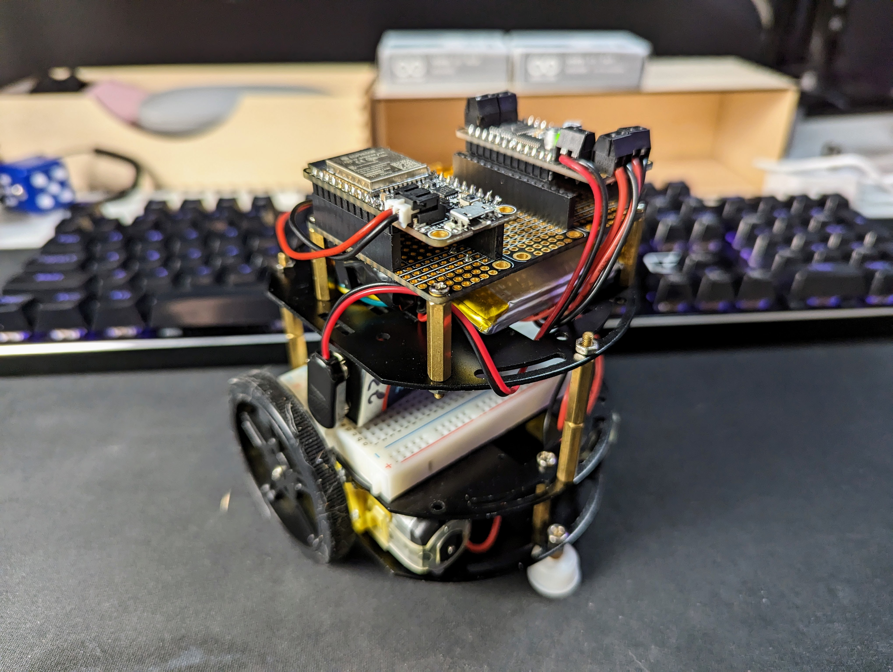
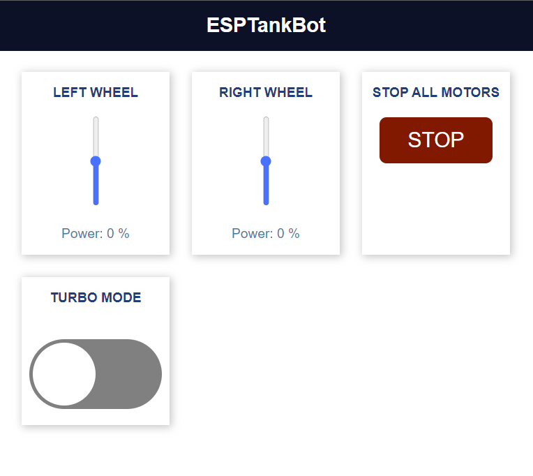

# ESP Tankbot
### *WiFi Motor Control*



This project provides a simple way to control two DC motors using an Adafruit motor shield and a WebSocket connection. The program receives messages over the WebSocket connection and uses these messages to control the speed and direction of the motors.

## Getting Started

To use this program, you will need an ESP32 (I'm using the Adafruit Huzzah ESP32 board, an Adafruit motor-shield, and a Wi-Fi network. You will also need to install the Arduino IDE/VS Code + PIO and the required libraries.

1. Connect the Adafruit motor shield to the ESP32 board.
2. Open the `main.cpp` file in the Arduino IDE.
3. Modify the Wi-Fi credentials to match your SSID/password.
   * Be sure to create a new header file called `src\WiFiCredentials.h` and add the following code:
   ```
   #define SSID "YOUR_SSID_HERE"
   #define PASSWORD "YOUR_PASSWORD_HERE"
   ```
4. Upload the code to the ESP32 board.
5. Open the Serial Monitor to view the IP address of the ESP32 board.
6. Open a web browser and connect to the IP address of the ESP32 board.

## Usage



The program listens for messages over the WebSocket connection and responds to the following commands:

- `1sX`: Set the speed of the left motor to `X`, where `X` is a value between -100 and 100.
- `2sX`: Set the speed of the right motor to `X`, where `X` is a value between -100 and 100.
- `stopMotors`: Stop both motors.
- `getValues`: Get the current slider values.

The program also supports a turbo mode, which increases the speed of the motors. To enable turbo mode, send the message `"turbotrue"` over the WebSocket connection. To disable turbo mode, send the message `"turbofalse"`.

## Contributing

Contributions to this project are welcome. If you find a bug or have a feature request, please open an issue on GitHub. If you would like to contribute code, please fork the repository and submit a pull request.

## License

This project is licensed under the MIT License. See the `LICENSE` file for details.

## Resources

* Big thanks to [Random Nerd Tutorials](https://randomnerdtutorials.com/esp32-web-server-websocket-sliders/) - I used their tutorial for a good portion of this to get started
  
* [Adafruit Huzzah32](https://learn.adafruit.com/adafruit-huzzah32-esp32-feather/overview)

* [Adafruit DC Motor Featherwing](https://learn.adafruit.com/adafruit-stepper-dc-motor-featherwing)
